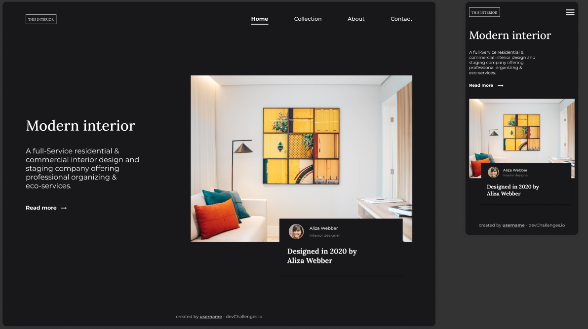

<!-- Please update value in the {}  -->

<h1 align="center">Interior Consultant</h1>

   Solution for a challenge from  <a href="http://devchallenges.io" target="_blank">Devchallenges.io</a>.

  <h3>
    <a href="https://interior-consultant-lemartins07.vercel.app">
      Demo
    </a>
     | 
    <a href="https://devchallenges.io/solutions/YsgJ12RwqJMV2fMtoZPE">
      Solution
    </a>
     | 
    <a href="https://devchallenges.io/challenges/Jymh2b2FyebRTUljkNcb">
      Challenge
    </a>
  </h3>

<!-- TABLE OF CONTENTS -->

## Table of Contents

- [Overview](#overview)
  - [Built With](#built-with)
- [Features](#features)
- [Contact](#contact)

<!-- OVERVIEW -->

## Overview

Introduce your projects by taking a screenshot or a gif. Try to tell visitors a story about your project by answering:

### Built With

- HTML 
- CSS
- SASS
- Javascript

## Features

<!-- List the features of your application or follow the template. Don't share the figma file here :) -->

This application/site was created as a submission to a [DevChallenges](https://devchallenges.io/challenges) challenge. The [challenge](https://devchallenges.io/challenges/Jymh2b2FyebRTUljkNcb) was to build an application to complete the given user stories.

## Contact

- Website [portfolio-lemartins07.vercel.app](https://{https://portfolio-lemartins07.vercel.app/})
- GitHub [@lemartins07](https://{github.com/lemartins07})
- Twitter [@lemartins07](https://{twitter.com/lemartins07})
